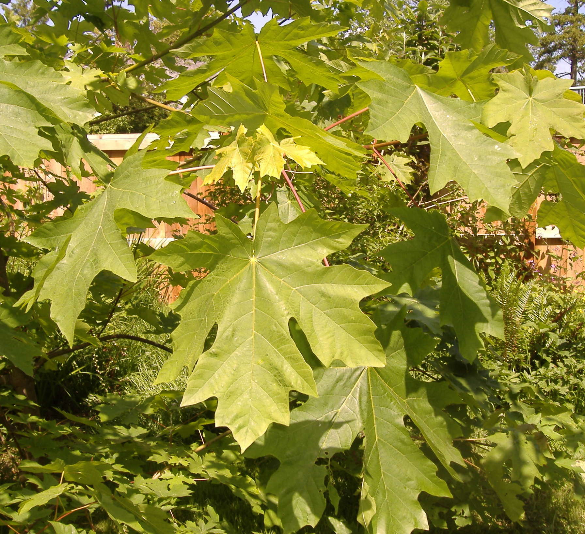
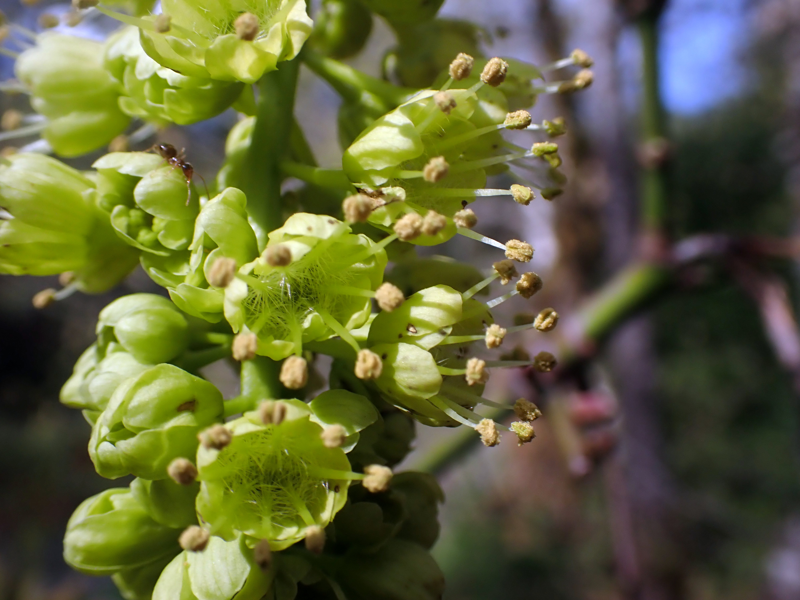
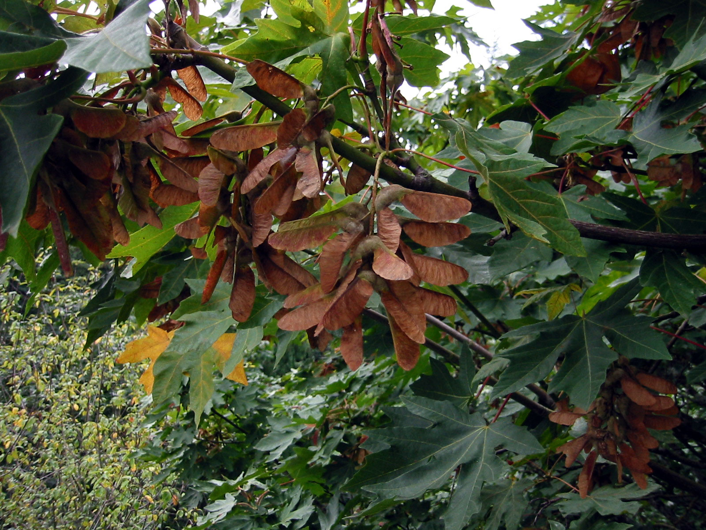
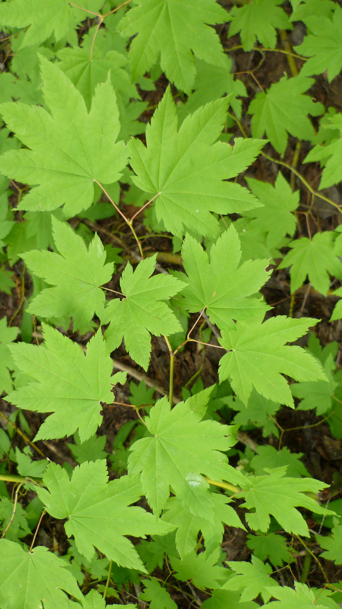
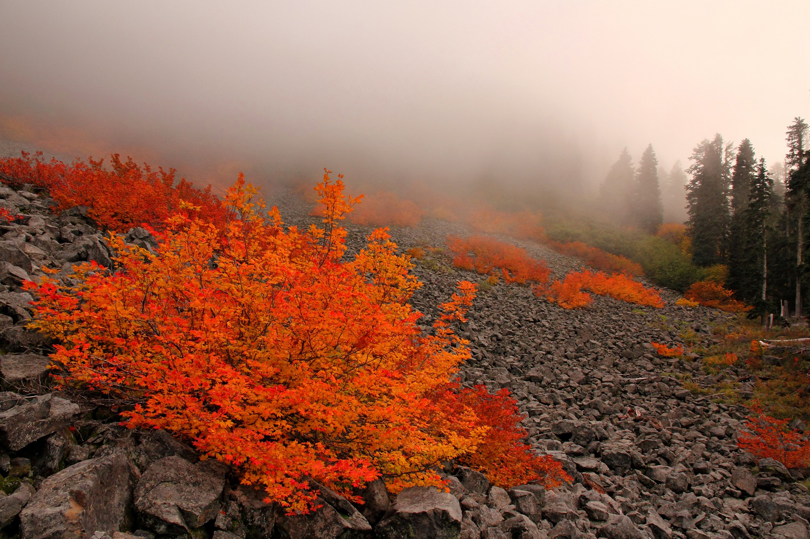

# Meet the Indigenous Trees of Seattle

## Genus Acer

### Acer macrophyllum - Bigleaf Maple, Oregon Maple

    
    

    
    

#### Characteristics

* Height: 100 ft
* Canopy: 50 ft
* Reproduction:
    - Angiosperm
    - Hermaphroditic
        - Blooms in Spring (April to May)
    - Pollinated by Insects and Wind
    - Produces Double Samara Fruits ("Helicopters")

#### Fun Facts

* Maple syrup can be made from its sap, just like the Sugar Maple!

#### References

* [Acer macrophyllum (Wikipedia)](https://en.wikipedia.org/wiki/Acer_macrophyllum)
* [WSU PNW - Washington State University NorthWest Plants Database system](https://pnwplants.wsu.edu/PlantDisplay.aspx?PlantID=7)
* [Acer macrophyllum (Burke Herbarium Image Collection)](https://burkeherbarium.org/imagecollection/taxon.php?Taxon=Acer+macrophyllum)
*  Krzysztof Ziarnek, Kenraiz (2020), [https://commons.wikimedia.org/wiki/File:Acer_macrophyllum_kz06.jpg](https://commons.wikimedia.org/wiki/File:Acer_macrophyllum_kz06.jpg), CC BY-SA 4.0
* Tony Perodeau (2006), [https://commons.wikimedia.org/wiki/File:Acer_macrophyllum_1199.jpg?uselang=en](https://commons.wikimedia.org/wiki/File:Acer_macrophyllum_1199.jpg?uselang=en), Public Domain
* Kollibri1969 (2024), [https://commons.wikimedia.org/wiki/File:Bigleaf_maple_(Acer_macrophyllum)_closeup_of_flowers.jpg](https://commons.wikimedia.org/wiki/File:Bigleaf_maple_\(Acer_macrophyllum\)_closeup_of_flowers.jpg), CC BY-SA 4.0
* Walter Siegmund (2004), [https://commons.wikimedia.org/wiki/File:Acer_macrophyllum_3158.jpg](https://commons.wikimedia.org/wiki/File:Acer_macrophyllum_3158.jpg), CC BY-SA 3.0

### Acer circinatum - Vine Maple

    
    
    

    
    

#### Characteristics

* Height: 26 ft
* Many Stemmed Base
    - Branches are from 1-4 in
* Lifespan: 80-90 year
* Reproduction:
    - Angiosperm
    - Hermaphroditic?
        - Blooms in ?
    - Pollinated by Insects and Wind
    - Produces Double Winged Sarama Fruits ("Helicopter")

#### Fun Facts

* Maple syrup can be made from its sap, just like the Sugar Maple!

#### References

* [Acer circinatum (Wikipedia)](https://en.wikipedia.org/wiki/Acer_circinatum)
* [Native Plants PNW](https://nativeplantspnw.com/vine-maple-acer-circinatum/)
* [Acer circinatum (Burke Herbarium Image Collection)](https://burkeherbarium.org/imagecollection/taxon.php?Taxon=Acer%20circinatum)
* Ryan Franklin (2013), [`https://commons.wikimedia.org/wiki/File:Vine_Maple_near_Deer_Creek_-_Ryan_Franklin_(11409292685).jpg`](https://commons.wikimedia.org/wiki/File:Vine_Maple_near_Deer_Creek_-_Ryan_Franklin_\(11409292685\).jpg), CC BY 2.0
* Krzysztof Golik (2017), [`https://commons.wikimedia.org/wiki/File:Acer_circinatum_in_Hackfalls_Arboretum_(1).jpg`](https://commons.wikimedia.org/wiki/File:Acer_circinatum_in_Hackfalls_Arboretum_\(1\).jpg), CC BY-SA 4.0
* El Grafo (2012), [`https://commons.wikimedia.org/wiki/File:Acer_circinatum_%C3%96BG_2012-05-13_03.jpg`](https://commons.wikimedia.org/wiki/File:Acer_circinatum_%C3%96BG_2012-05-13_03.jpg), CC BY-SA 3.0
* Walter Siegmund (2008), [`https://commons.wikimedia.org/wiki/File:Acer_circinatum_9468.JPG`](https://commons.wikimedia.org/wiki/File:Acer_circinatum_9468.JPG), CC BY-SA 3.0
* Thayne Tuason (2011), [`https://commons.wikimedia.org/wiki/File:Acer_circinatum_1.jpg`](https://commons.wikimedia.org/wiki/File:Acer_circinatum_1.jpg), CC BY-SA 4.0
